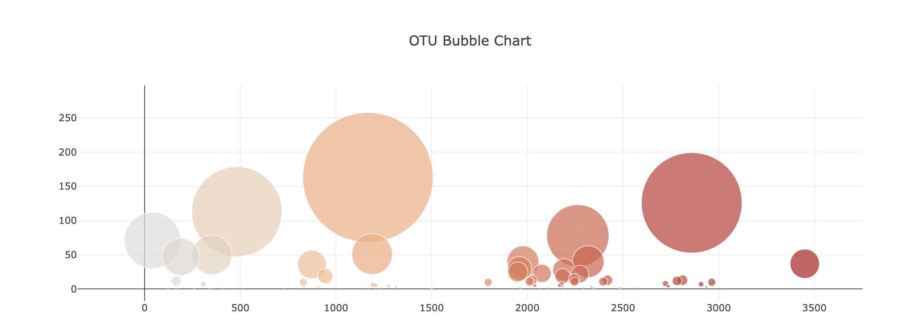

## Belly Button Biodiversity 

Full-Stack Data Analysis to build an interactive dashboard exploring the Belly Button Biodiversity Dataset, which catalogs the microbes that colonize human navels, using Plotly.js.

### Dataset:

 [Belly Button Biodiversity DataSet](http://robdunnlab.com/projects/belly-button-biodiversity/).

## Objectives

### Step 1 - D3

Use Plotly.js to build interactive charts for the dashboard

* Use the D3 library to read in samples.json from the URL. 

### Step 2 - Plotly.js Bar Chart

* Create a Bar Chart that uses data from the samples.json to display the top 10 samples
    * Use `sample_values` as the values for the Bar Chart
    * Use `otu_ids` as the labels for the Bar Chart
    * Use `otu_labels` as the hovertext for the Bar Chart

### Step 3 - Plotly.js Bubble Chart

* Create a Bubble Chart that uses data from the samples.json to display each sample
    * Use `otu_ids` for the x values
    * Use `sample_values` for the y values
    * Use `sample_values` for the marker size
    * Use `otu_ids` for the marker colors
    * Use `otu_labels` for the text values

### Step 4 - Demographics JSON

* Display the sample metadata from the samples.json
    * Display each key/value pair from the metadata JSON object on the top left of the page

* Update all of the plots any time that a new sample is selected

---------------------------------------------------

<b>Contact:</b> bronwynmilne64@gmail.com
